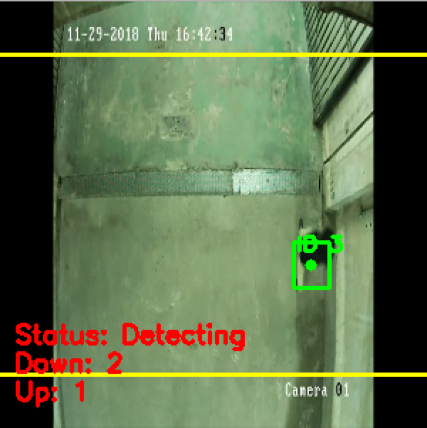

# People detection and tracking in the OCP sites.

This repository assembles the necessary code for people detection, tracking and counting. The object detection has been done with the SSD Mobilenet model from the [Tensorflow Detection Model Zoo](https://github.com/tensorflow/models/blob/master/research/object_detection/g3doc/detection_model_zoo.md).

The main code is in the file **people_counter.py**. The algorithm used combines both object detection and object tracking.
This hybrid approach will allow us to significantly reduce the computational burden of the detection.

The SSD Mobilenet model files are stored in the **inference_graph_ssd_mobilenet_v2/** folder. 
The Centroid Tracking algorithm is stored in the **pyimagesearch/** folder.


### Prerequisites

To run this code, you'll need to install some python libraries : Numpy, OpenCv, dlib, imutils, intervals.

To install dlib use this guide : 
* [dlib](https://www.pyimagesearch.com/2018/01/22/install-dlib-easy-complete-guide/) - Installation guide
To install the other libraries, simply use a pip install command

### How to run the code 

We have six command line arguments which allow us to pass information to our people counter script from the terminal at runtime :

--prototxt : The path to the frozen graph file.

--model : The path to the pbtxt file.

--input : Optional input video file path. If no path is specified, your webcam will be utilized.

--output : Optional output video path. If no path is specified, a video will not be recorded.

--confidence : With a default value of 0.4 , this is the minimum probability threshold which helps to filter out weak detections.

--skip-frames : The number of frames to skip before running our DNN detector again on the tracked object. Remember, object detection is computationally expensive, but it does help our tracker to reassess objects in the frame. By default we skip 30  frames between detecting objects with the OpenCV DNN module and our CNN single shot detector model.

For example, if we are in the object-detection folder :

```
python people_counter.py --prototxt /inference_graph_ssd_mobilenet_v2/frozen_inference_graph.pb --model /inference_graph_ssd_mobilenet_v2/graph.pbtxt --input /videos/compilation_highD_to_use.mp4 --output /output/test_output.avi --skip-frames 2
```

### How does the tracking work :

Each frame of the input video file is divided into 3 areas :

- **The top area** : The top zone of the frame; area = 1/8 of the total area of the frame.

- **The bottom area** : The bottom zone of the frame; area = 1/8 of the total area of the frame.

- **The medium area** : The zone between the **top** and **bottom** area.



To consider whether a person is going up or down, we need to figure out if it is moving up or down.

To do so, we grab the y-coordinate value for all previous centroid locations for the given object. Then we compute the direction  by taking the difference between the current centroid location and the mean of all previous centroid locations.

The reason we take the mean is to ensure our direction tracking is more stable. If we stored just the previous centroid location for the person we leave ourselves open to the possibility of false direction counting. Keep in mind that object detection and object tracking algorithms are not “magic” — sometimes they will predict bounding boxes that may be slightly off what you may expect; therefore, by taking the mean, we can make our people counter more accurate.

To **count** a person as going up ( "Symetric" condition to count a person as going down ), some conditions should be satisfied : 

- The person should not have been counted before

- The person's direction should indicate that it is going up.

- The person is in the **top zone**.

- At least one of its previous y-coordinates should indicate that it has been in the **bottom zone** before.


The reason why I added the last condition is because we don't want to count a person that has done a "U turn".

**Examples**:
- If a person crosses the screen from the bottom to the top, it will be counted as going up ( All conditions satisfied )

- If a person comes from the top of the screen and does a "U turn" without reaching the **bottom zone** then it won't be counted as going up. ( 4 th condition not satisfied )

- If a person comes from the top of the screen and does a "U turn" after reaching the **bottom zone** then it will be counted as going down after reaching the **bottom zone** and as going up after reaching the **top zone**. +1 -1 = 0 so it's as if we didn't count the person that did the "U turn".
